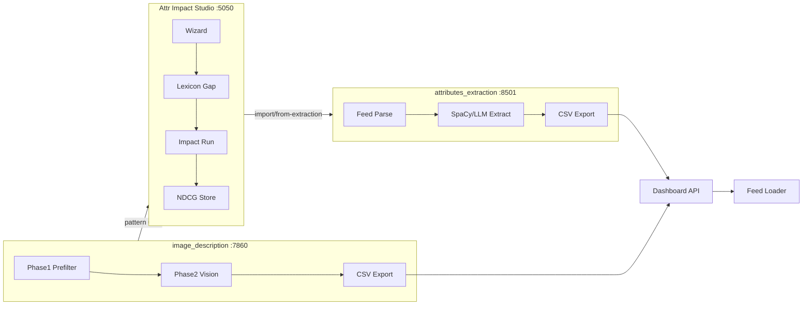

# 08. Техническая архитектура

## Обзор

Три репозитория образуют единый продуктовый контур без дублирования кода. **attr-enrichment-product** — только документация, decks и glue-скрипты.

---

## Репозитории и роли

| Репозиторий | Путь (локально) | Порт | Роль в продукте |
|-------------|-----------------|------|-----------------|
| attr-impact-studio | Desktop/attr-impact-studio | 5050 | Оценка, прогноз, NDCG, источник deck-data |
| attributes_extraction-main | Desktop/attributes_extraction-main | 8501 | Text stream |
| image_description-main | Desktop/image_description-main | 7860 | Vision stream |
| **attr-enrichment-product** | Desktop/attr-enrichment-product | — | Product hub |

---

## Data flow (happy path)

1. **Диагностика:** фид → Studio Wizard → lexicon gap + impact JSON.
2. **Extraction:** фид + конфиг атрибутов → text или vision pipeline → CSV `(external_id, attr_name, attr_value)`.
3. **Upload:** CSV → `dashboard_feed_attributes.py` → Diginetica Dashboard (TOTP).
4. **Индексация:** Feed Loader подхватывает custom attrs.
5. **Оценка:** Studio NDCG + CH zero% → QBR deck.

---

## Точки интеграции (уже в коде)

| Интеграция | Направление | Назначение |
|------------|-------------|------------|
| `POST /api/import/from-extraction` | extraction → Studio | Импорт результатов text |
| `attr_impact_studio_transfer.py` | vision → Studio | Webhook draft |
| `befree_pattern_impact_study.py` | vision → Studio | Pattern impact study |
| `dashboard_feed_attributes.py` | оба → Dashboard | Заливка атрибутов |

---

## Атрибуты Dashboard (стандартные имена)

| Атрибут | Стрим | Пример |
|---------|-------|--------|
| `digi_attr_image` | Vision | OCR надпись с упаковки |
| `digi_attr_pattern` | Vision | Принт, узор |
| Custom text attrs | Text | material, age_group, … |

**Правило:** не дублировать в атрибутах то, что уже в названии/категории/params фида.

---

## Инфраструктура

| Компонент | Требование |
|-----------|------------|
| GPU | Ollama vision models (локальный пул, порт 11434/11435) |
| Studio | Flask, Python 3.11+ |
| Extraction | Streamlit / Gradio UI + batch CLI |
| Секреты | Dashboard login + TOTP (не в git) |

См. skill **ollama-pool-router** для настройки очереди.

---

## Безопасность

- Данные каталога и фото обрабатываются on-prem.
- TOTP для заливки вводит партнёр (не храним в репо).
- `dashboard_sent.json` — трекинг отправленных ключей, без значений атрибутов в логах.

---

## Ограничения (технические)

- Три отдельных UI (Studio, Streamlit, Gradio) — единая точка входа через README product hub.
- Vision quality зависит от качества фото в фиде.
- Batch 100k+ SKU — планирование GPU-очереди обязательно.

---

*Версия: 2026-Q3*
