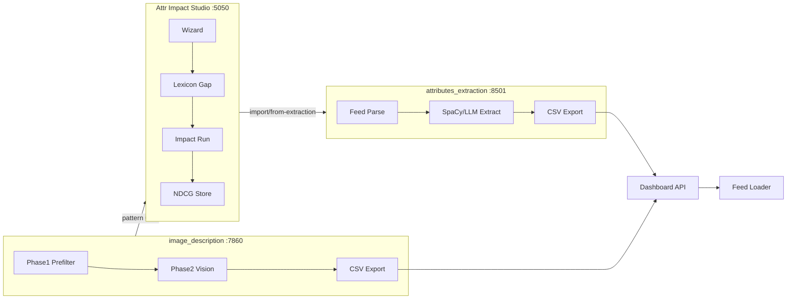

# 08. Техническая архитектура

## Обзор

Три репозитория образуют единый продуктовый контур **без дублирования кода**.  
**attr-enrichment-product** — только документация, decks, pricing glue. **Код трёх репо не меняем** на этапе 1.



---

## Репозитории и роли

| Репозиторий | Путь (локально) | Порт | Роль в продукте |
|-------------|-----------------|------|-----------------|
| attr-impact-studio | Desktop/attr-impact-studio | 5050 | Оценка, прогноз, NDCG, deck-data source |
| attributes_extraction-main | Desktop/attributes_extraction-main | 8501 | Text stream |
| image_description-main | Desktop/image_description-main | 7860 | Vision stream |
| **attr-enrichment-product** | Desktop/attr-enrichment-product | — | Product hub, docs, decks |

**GitHub (reference):**

- https://github.com/zapnikita95/attr-impact-studio
- https://github.com/zapnikita95/attributes_extraction
- https://github.com/zapnikita95/image_description

---

## Data flow (happy path)

| Step | Actor | Input | Output |
|------|-------|-------|--------|
| 1. Диагностика | Analyst | YML/XML feed | lexicon gap + impact JSON |
| 2. Scope sign-off | PM + Sales | impact JSON | attribute list, SKU scope |
| 3. Extraction | Eng | feed + config | CSV `(external_id, attr, value)` |
| 4. QA | Eng + Analyst | 1% sample | corrected CSV |
| 5. Upload | Eng + Partner TOTP | CSV | Dashboard custom attrs |
| 6. Index | Platform | Feed loader | searchable attrs |
| 7. Eval | Analyst | CH + Studio | QBR metrics |
| 8. Report | Analyst | metrics | HTML deck / PDF |

**Latency:** upload → index typically 24–72h (partner-dependent).

---

## Точки интеграции (уже в коде)

| Интеграция | Направление | Назначение |
|------------|-------------|------------|
| `POST /api/import/from-extraction` | extraction → Studio | Импорт text results |
| `attr_impact_studio_transfer.py` | vision → Studio | Webhook draft |
| `befree_pattern_impact_study.py` | vision → Studio | Pattern impact study |
| `dashboard_feed_attributes.py` | оба → Dashboard | Заливка атрибутов |
| `scripts/befree_dashboard_upload_ui.py` | Eng UI | TOTP browser upload (:8766) |

**Правило feed collision:** не дублировать в атрибутах значения из title/category/params (см. workspace rule feed-markup-before-attributes).

---

## Атрибуты Dashboard (стандартные имена)

| Атрибут | Стрим | Пример значения |
|---------|-------|-----------------|
| `digi_attr_image` | Vision | OCR: «МАГНИЙ B6» |
| `digi_attr_pattern` | Vision | leopard, geometric |
| `form` | Vision | snake, skull, heart |
| `metal_color` | Vision | yellow_gold, silver |
| Custom text attrs | Text | material, age_group, character |

CSV format для upload:

```csv
external_id,attribute_name,attribute_value
SKU123,digi_attr_image,ОРТОСТЕЛЬ
SKU456,form,snake
```

---

## Vision pipeline (image_description)

```
Feed images URL → Phase1 prefilter (quality, category) → Phase2 Ollama vision
    → attribute_detector rules → delta vs feed → CSV export
```

| Компонент | Назначение |
|-----------|------------|
| Phase1 | Отсечь bad photos, wrong category |
| Phase2 | LLM vision extract |
| attribute_glossary.json | Allowed values, normalization |
| picture_dedupe | Skip duplicate images |
| ollama pool | Queue on 11434/11435 |

**Batch 50k SKU:** plan GPU queue 2–3 weeks.

---

## Text pipeline (attributes_extraction)

```
Feed parse → collision check vs title/params → SpaCy/LLM extract
    → glossary normalize → CSV export → Studio import
```

**LoRA / fine-tune:** optional for domain (kids 8858 case).

---

## Studio pipeline (attr-impact-studio)

| Wizard step | Output |
|-------------|--------|
| 1–2 | Feed stats |
| 3–4 | Lexicon gap |
| 5 | current_attrs audit |
| 6 | Attribute recommendations |
| 7 | Impact run JSON |
| NDCG | ndcg_store time series |

---

## Инфраструктура

| Компонент | Требование |
|-----------|------------|
| GPU | Ollama vision (local pool 11434/11435) |
| Studio | Flask, Python 3.11+ |
| Extraction | Streamlit 8501 / Gradio 7860 |
| Secrets | Dashboard login + TOTP — **не в git** |
| Network | CH read access for zero metrics |

См. skill **ollama-pool-router** для очереди.

---

## Безопасность

| Topic | Policy |
|-------|--------|
| Catalog data | On-prem processing |
| TOTP | Partner enters fresh code; UI 8766 or Gradio |
| Credentials | `~/.search-checkup-creds.json` or env — not committed |
| dashboard_sent.json | Track sent keys, not attr values in logs |
| Generated decks | May contain partner name — internal share only |

---

## Ограничения (технические)

| Limitation | Mitigation |
|------------|------------|
| 3 separate UIs | Product hub README + start.bat |
| Vision ∝ photo quality | Phase1 + QA sample |
| 100k+ SKU batch | GPU planning, ollama-queue-proxy |
| Index lag after upload | Set T3 eval +4 weeks |
| No unified auth | Per-tool credentials |

---

## Deployment checklist (Eng)

- [ ] Studio :5050 up, feed import works
- [ ] Ollama models pulled, GPU verified
- [ ] Dashboard creds + TOTP contact at partner
- [ ] `dashboard_sent.json` path configured
- [ ] CH credentials for analyst (phase 8)

---

*Версия: 2026-Q3 · attr-enrichment-product*
